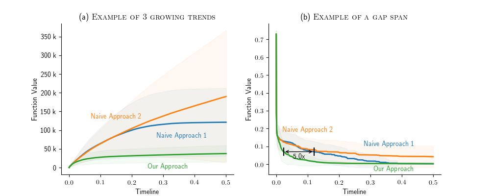
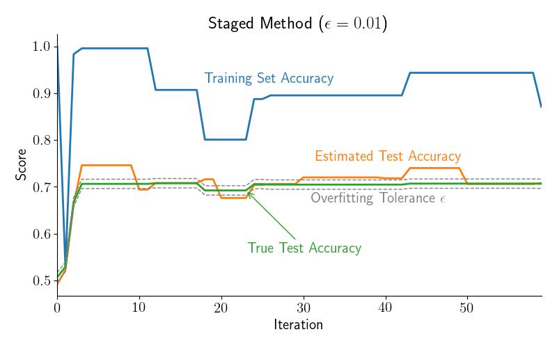

# Figure Pimp: Here to pimp-up your figures

This repo is intended to be a collection of DS3 Lab Figure designs and utilities.

If you have a cool figure that you used in one of your papers that you think others can find useful, please consider adding it to this repo!

*Note:* All code here is intended to be used as snippets and/or inspiration. It might change in the future. In order to ensure your own code is reproducable, it's best to copy the pieces you need to your own repo instead of relying on the future stability of this one.

## Currently added figure designs

### Shaded Error Area Plot

This plot can show one or more lines with a shaded area that represents error bars (i.e. standard deviation). It can display labels next to each line. Labels need to be positioned manually. The y-axis labels can be displayed in human readable format (e.g. use 3 k instead of 3000). It also supports showing a horizontal arrow that denotes a relative difference between two points that have the same y-axis values.



Usage:

```python
import figurepimp
import matplotlib.pyplot as plt
import pandas as pd

# Read a CSV with an index column and 3 pairs of columns. Each pair represents a mean and std value series.
data = pd.read_csv('sample_data.csv', index_col=0)

# Create a figure f with a single Axes instance ax.
f, ax = plt.subplots(1, 1)

# Draw the shaded error area plot.
figurepimp.shaded_error_area(ax,
                             timeline=data.index,
                             results_mean=[data['mean_1'], data['mean_2'], data['mean_3']],
                             results_std=[data['std_1'], data['std_2'], data['std_3']],
                             result_labels=['Label 1', 'Label 2', 'Label 3'],
                             xaxis_label='Title of X-Axis',
                             yaxis_label='Title of Y-Axis',
                             result_label_locations=[(0.0, 1.0), (1.0, 1.0), (1.0, 0.0)],
                             title='Title of Subplot',
                             human_readable_labels=True)

# Optional: Draw a horizontal line showing a relative difference between two points on the two lines.
difference_span(ax, timeline=data.index, line1=data['mean_1'], line2=data['mean_2'], cutoff_value=0.07)

# Show the figure window.
plt.show()

```

## Utilities

There are also a few commonly useful utilities for dealing with figures.

### Style

To simply apply the basic style to a figure, use the `apply_style` function. It just removes the top and right
axes and specifies a given font size.

### The Real Legend

Everyone knows legends are the worst thing ever invented by humans. A much better thing is to place labels in the
figure that lie near to the lines/objects. If they are far away, we can draw an arrow between the label and the
line.

We all know this is extremely tedious to do by hand every time, especially if you want to use `matplotlib` to
generate your figures (which is generally a great tool). To solve this, you can use the `real_legend` function.

Here is an example of the simplest usage:

```python
import figurepimp
import pandas as pd

# Read a CSV with an input data. Each column will be plotted as a single line, with the column name as a label.
pd.read_csv('sample_data.csv', index_col=0).plot()

# Apply the real legend.
figurepimp.real_legend()

```

You may get something like this:



Also, in the figure drawn by using the `shaded_error_area` shown above, we could omit the `result_label_locations`
and use the `real_legend` function to automatically place the labels. Here is an example based on the previous one:

```python
# Create a figure f with a single Axes instance ax.
f, ax = plt.subplots(1, 1)

# Draw the shaded error area plot.
lines = figurepimp.shaded_error_area(ax,
                                     timeline=data.index,
                                     results_mean=[data['mean_1'], data['mean_2'], data['mean_3']],
                                     results_std=[data['std_1'], data['std_2'], data['std_3']],
                                     result_labels=['Label 1', 'Label 2', 'Label 3'],
                                     xaxis_label='Title of X-Axis',
                                     yaxis_label='Title of Y-Axis',
                                     result_label_locations=None,  # Set this to None.
                                     title='Title of Subplot',
                                     human_readable_labels=True)

# Apply the real legend.
figurepimp.real_legend(ax, lines)

plt.show()

```

## Contributing

Each figure design should have a directory under `figurepimp`. Consider adding a `sample.py` with a usage example. It should also generate a `sample.png` to showcase what king of figure it represents.
